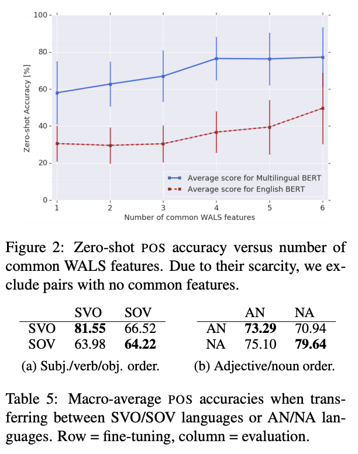

## How Multilingual is Multilingual BERT?

Telmo Pires, Eva Schlinger, Dan Garrette

Google Research

2019

https://arxiv.org/abs/1906.01502

### Overview

In this work, the researchers evaluate the effectiveness of multilingual BERT at cross-lingual transfer. 

### Key findings

1. mBERT is NOT memorizing vocabularies (at least for the named entity recognition task). NER performance is consistent regardless of how much word piece overlap between the language used for fine tuning and the language used for zero-shot evaluation. See Figure 1.
2. mBERT can do cross-lingual transfer across languages with entirely different scripts. For example, part of speech fine tuning on Urdu (Arabic script) can be used for zero-shot learning on Hindi (Devanagari script) with **91% accuracy**. It's not as good in all cases, but still pretty excellent.
3. mBERT works better on zero-shot learning between languages with greater overlap in World Atlas of Language Structures (WALS) features. For example, languages with similar subject, object and verb ordering, as well as languages with similar adjective noun ordering, are better matches for zero shot learning. See Figure 2.
4. mBERT does not perform as well when words from one language are transliterated into another language (EX: Hindi written in Latin script), likely due to the pretraining per language.
5. By examining sentence similarity between translated language pairs, the authors are able to extract information about how well mBERT generalizes into a multi-lingual representation through its layers. The greatest level of cross-lingual generalization occurs about 2/3 of the way through the network. See Figure 3.

### Figure 1

### Figure 2

### Figure 3

