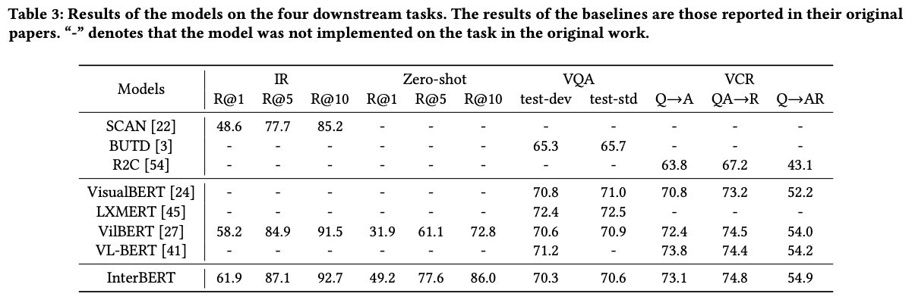
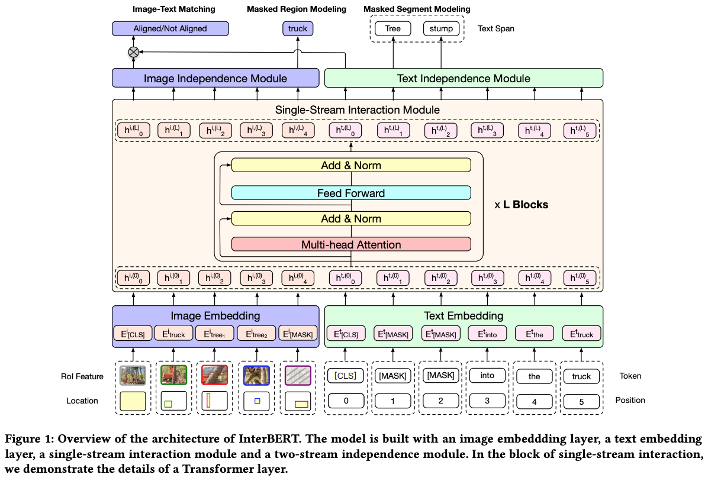
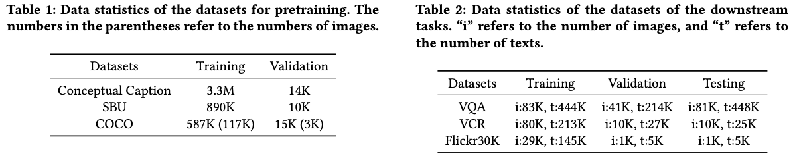

## InterBERT: Vision-and-Language Interaction for Multi-modal Pretraining

Junyang Lin, An Yang, Yichang Zhang, Jie Liu, Jingren Zhou, Hongxia Yang

Alibaba, MOE Key Lab of Computational Linguistics Peking U

2020 -- KDD

[Link](https://arxiv.org/pdf/2003.13198.pdf)

### Overview
The authors present interBERT, a multi-modal model for images and text. They pretrained on over 4M samples using Masked Segment Modeling (MSM) for text, Masked Region Modeling (MRM) for images, and Image-Text Matching (ITM) for images and text. Fine tuning was performed on four tasks: (1) retrieving images based on an input caption, (2) zero-shot image retrieval based on captions, (3) Visual QA (ask the model a question pertaining to provided images), and (4) Visual commonsense reasoning. The model outperforms the benchmark models for the image retrieval task, is comparable to the benchmarks for visual QA, and outperforms the benchmarks for two of the commonsense sub-tasks (see below). 

They also pre-trained the first Chinese multimodal model using 3.1M image-text pairs from TaoBao across the "women's clothes" use case. They then finetune on "women's shoes."

### Architecture
The architecture is shown below. It consists of separate image and text embedding layers, followed by a joint "single-stream interaction module," followed by separate "independence modules."

### Datasets

The following datasets were used for pre-training and for downstream tasks.

