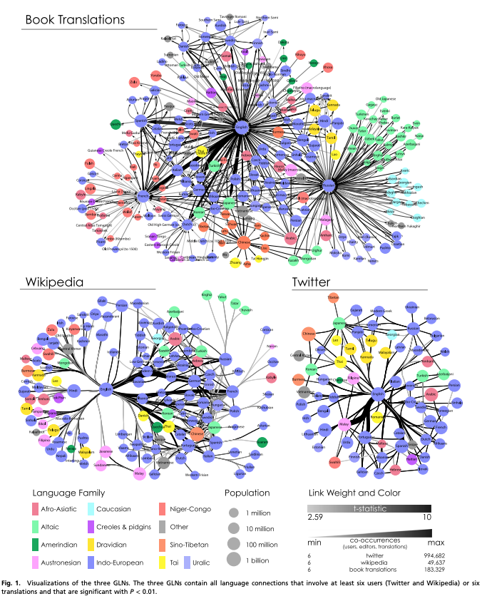

## Links that speak: The global language network and its association with global fame

Shahar Ronena, Bruno Gonçalvesb, Kevin Z. Hua, Alessandro Vespignanib, Steven Pinkere, and César A. Hidalgoa,

2014

https://www.pnas.org/content/pnas/111/52/E5616.full.pdf

http://language.media.mit.edu/visualizations/books

### Overview:

This research group sought to characterize the global influence of a particular language by examining translations between pairs of languages. These pairings then form graphs, from which natural "hubs" are discernable (see below). The find that "The GLNs, mapped from millions of online and printed linguistic expressions, reveal that the world’s languages exhibit a hierarchical structure dominated by a central hub, English, and a halo of intermediate hubs, which include other global languages such as German, French, and Spanish. Although languages such as Chinese, Arabic, and Hindi are immensely popular, we document an important sense in which these languages are more peripheral to the world’s network of linguistic influence." 

### Datasets:

1. **The books dataset** was taken from 2.2 million translations of published books from 1979-2011.
2. **The twitter dataset** was taken from over 1 billion tweets between Dec 2011 and Feb 2012. Connections are formed when a given user is likely to speak in a second language (more on that point later).
3. **The wikipedia dataset** was taken from all article edits through 2011. Language connections occur when one editor is likely to edit an article in another language.

### Methods:

To create the graph edges in the Twitter and Wikipedia graphs, they use the correlation metric and the *t*-statistic to measure the statistical significance of a language pair beyond what would be expected based on the prevalence of the languages alone. They consider links only with *P*<0.01.

Additionally, they investigate the eigenvector centrality of the nodes, which is similar to PageRank. I.E. hubs are rewarded when connected to other hubs.

Finally, the researchers examine quantities of famous people per language, correlated with their graphs.

### Cool pictures:

