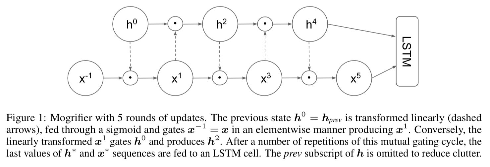
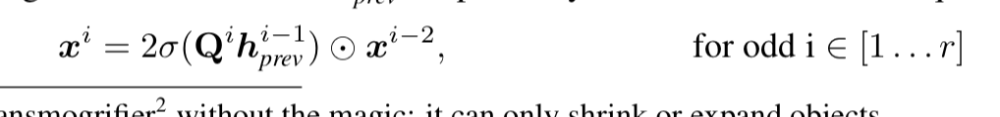
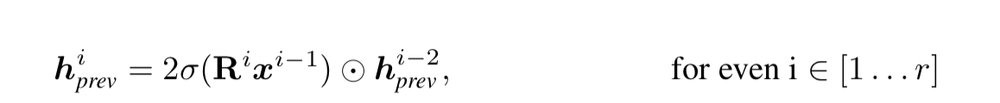
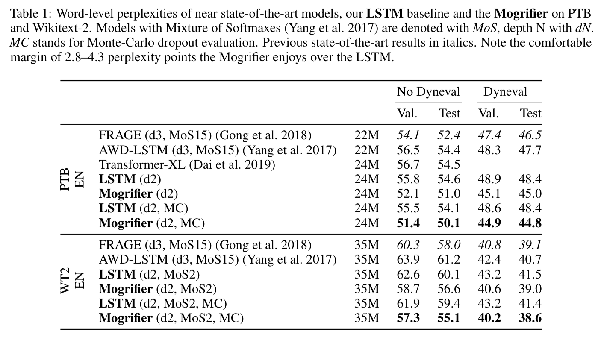
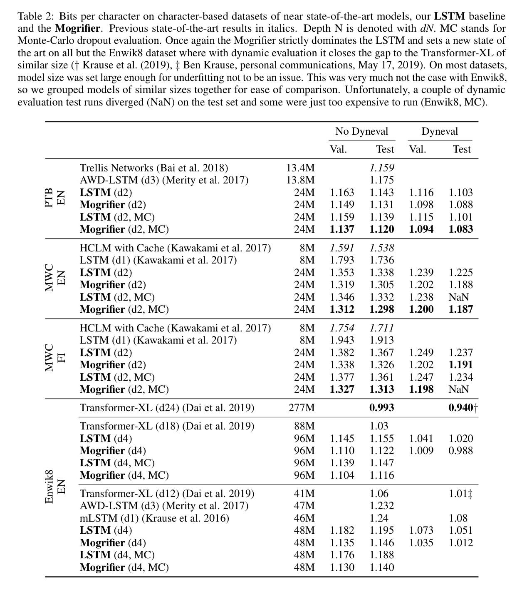

## Mogrifier LSTM

Gábor Melis, Tomáš Kocˇiský, Phil Blunsom

Deep Mind, Oxford

2020

[Link](https://arxiv.org/abs/1909.01792)

*Hat tip to Dustin Axman for sharing this with me.*

## Overview

The current trend, these authors argue, is to create ever larger models using ever larger datasets, rather than focusing on the architecturally driven inductive biases that lead to good generalization. Instead, smaller datasets should be used in some cases, so that model size is no longer the limiting factor, and focus can be kept on architectural optimization for performance, rather than scalability.

Their system achieves state of the art on two word-level language modeling datasets (Penn Treebank and Wikitext-2) and three character-based language modeling datasets (PTB, MWC English, MWC Finnish).

## Methods

The Mogrifier LSTM does not change the LSTM cell, but instead alters the inputs to each LSTM cell. Normally, the LSTM cell would ingest the hidden state, *h_prev* from the previous cell, as well as the current sequence input (i.e. the current word/token/letter), *x*. In the mogrifier, these two inputs modulate each other *r* times, according to two new weight matrices called *Q* and *R*, and are fed through sigmoids. See Figure and equations below. They found through hyperparameter tuning that 4 rounds (*r*=4) is best.

## Result tables

