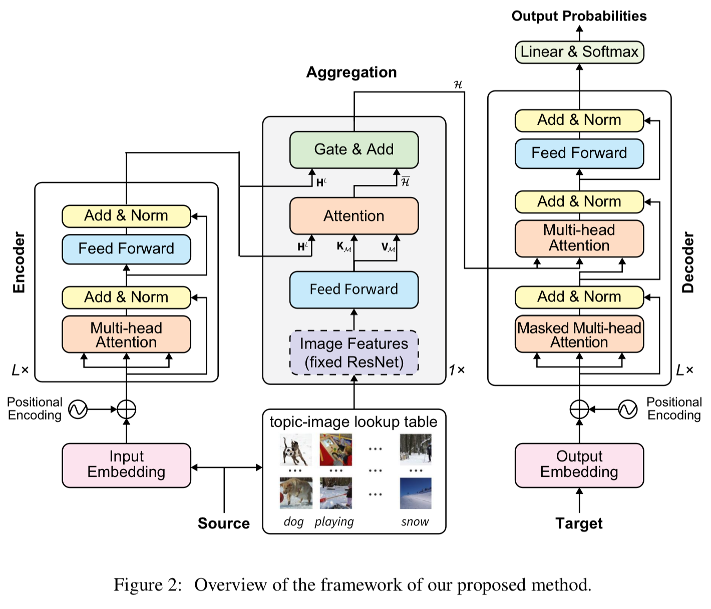
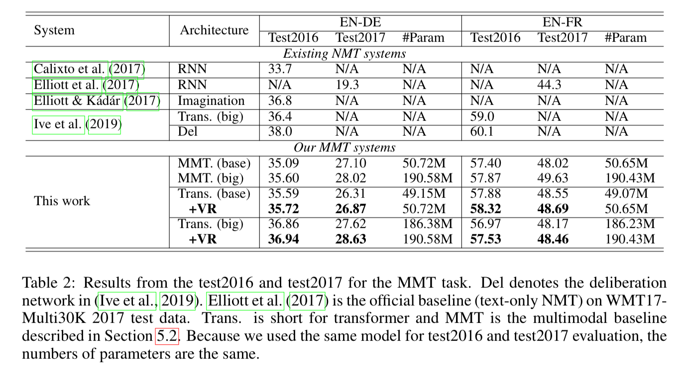

## Neural Machine Translation with Universal Visual Representation

Zhang et al.

Shanghai Jiao Tong U, et al.

2020 - ICLR

[Link](https://openreview.net/pdf?id=Byl8hhNYPS)

### Overview

Can we help our text translation systems perform better by feeding them pictures and allowing them to visualize the objects in question? That's the idea behind this paper from ICLR. During a pre-training phase, source sentences and their corresponding images (encoded by a pre-trained ResNet) are merged together in the attention layer, allowing the model to learn both the language and the corresponding visual representations. Later the model is used to do text-only translation, and it performs better than a model that had been trained only with text.

Similar approaches had been tried previously using parallel corpora tied to a single image. This approach is novel in that it only uses monolingually-annotated images.

### Methods

First they apply TF-IDF on the text such that only the important words are identified for a given sequence. They then use these words to search through the image corpus and identify the most appropriate images.

The images are fed into a pre-trained ResNet, which is followed by a fully connected network. Attention is then used to learn the importance of each image relative to the text sequence.

Image count per text sequence was set to 5, and images were taken from the Multi30K dataset. For text, WMT datasets for Romanian, German, and French were used (paired to English). Text data were tokenized using byte pair encoding with a vocabulary of 40k. They used label smoothing of 0.1, dropout of 0.1, and ADAM for optimization. Early stopping was implemented based on stablized BLEU over 10 epochs. Decoder beam size was 5, and a single V100 GPU was used for training.

A text-only transformer was used as the baseline. Their method introduces 1.5M parameters to the base transformer and 4.0M parameters to the large transformer.

### Results

