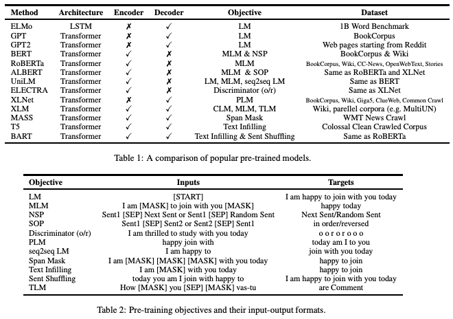

## A Survey on Contextual Embeddings

Qi Liu, Matt J. Kusner, Phil Blunsom

Deep Mind, Alan Turing Institute

2020

https://arxiv.org/abs/2003.07278

### Overview

This paper provides a nice overview of various contextual embeddings and techniques, including ELMo, BERT, T5, BART, and more. (hat tip to Doug Cole for sharing). Since the paper is, itself, a review, I won't rehash it here. But these two tables are quite helpful:

