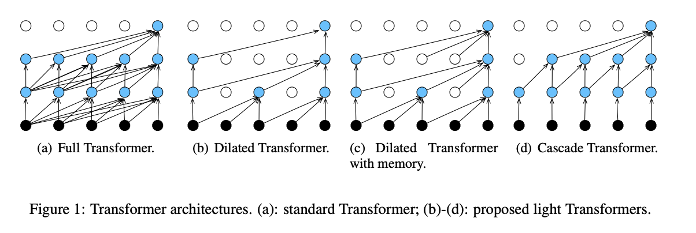

# Transformer on a Diet

*Chenguang Wang, Zihao Ye, Aston Zhang, Zheng Zhang, Alexander J. Smola*

Amazon

[https://arxiv.org/abs/2002.06170]

(hat tip to Cengiz Tirkaz for the find)

## Overview:

In this paper, the researchers attempt to substantially reduce the size of the tranformer architecture for the language modeling task. They argue that many current models are unwieldy for production tasks (EX: GPT-2 with 1.6B parameters). With their sparsest architecture, they reduce the parameters by 70% with a commensurate perplexity impact of only 7% on the PTB dataset and 5% on the WT-2 dataset.

## Architectures
The researchers explore four different architectures, as shown above and described below.

1. The Dilated Transformer: The first variant is similar to dilated CNNs. Starting from the input layer, nodes are exponentially removed going upward.
2. The Dilated Transformer with Memory: This variant is similar to the dilated transformer, but in this case, the "on" nodes can still access the previous layer.
3. The Cascade Transformer: This variant is similar to the full transformer, but with pruning at each layer that limits how far back (left) in the previous layer a given node can see.

## Results

~

~
