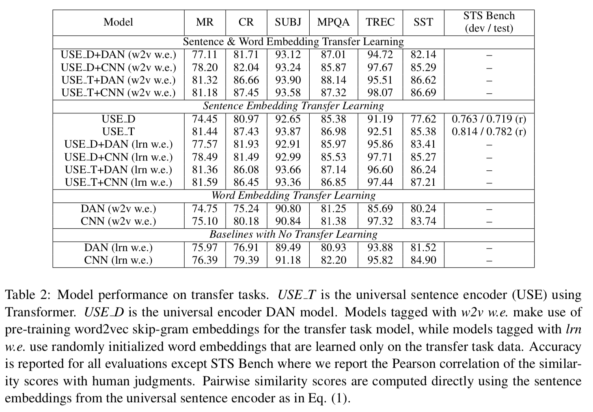
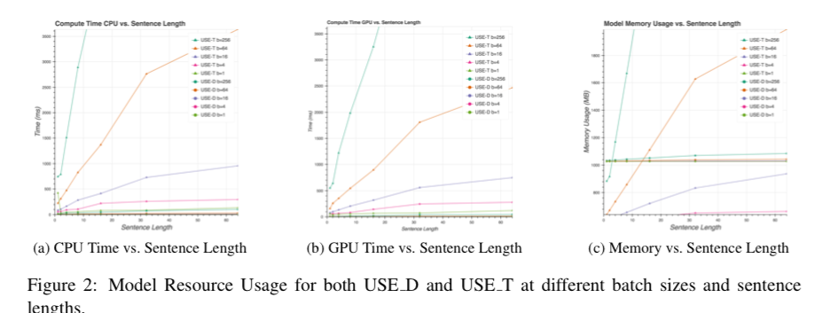

## Universal Sentence Encoder

Cer et al.

Google Research

2018

[Link](https://arxiv.org/abs/1803.11175)

## Overview

Traditionally (since 2013), word embeddings have been used as a sort of transfer learning for NLP tasks, such that each word is replaced with a dense vector representation. The goal of the sentence encoder is to expand that paradigm to the sentence level. These embeddings can either be used in a standalone manner, similar to word embeddings, or integrated into a larger model that is fine tuned, as with BERT and other deep contextual embeddings. The sentence embeddings are also useful for directly evaluating the similarity between two sentences.

## Methods
The USE team investigated two approaches, being (a) transformers and (b) Deep Averaging Networks (DANs). In the transformer approach, an encoder is used only, and it is trained on several tasks, including a skip-thought task, conversational response tasks, and supervised classification tasks. In the DAN approach, the embeddings for the unigrams and bigrams are averaged before passing through a feedforward network. The computational complexity is O(*n*^2) for the transformer but O(*n*) for the DAN, where *n* is sentence length.

A variety of transfer tasks are used, including sentiment analysis, opinion polarity, and QA.

## Results

