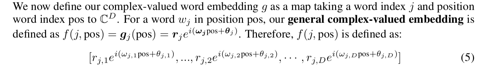
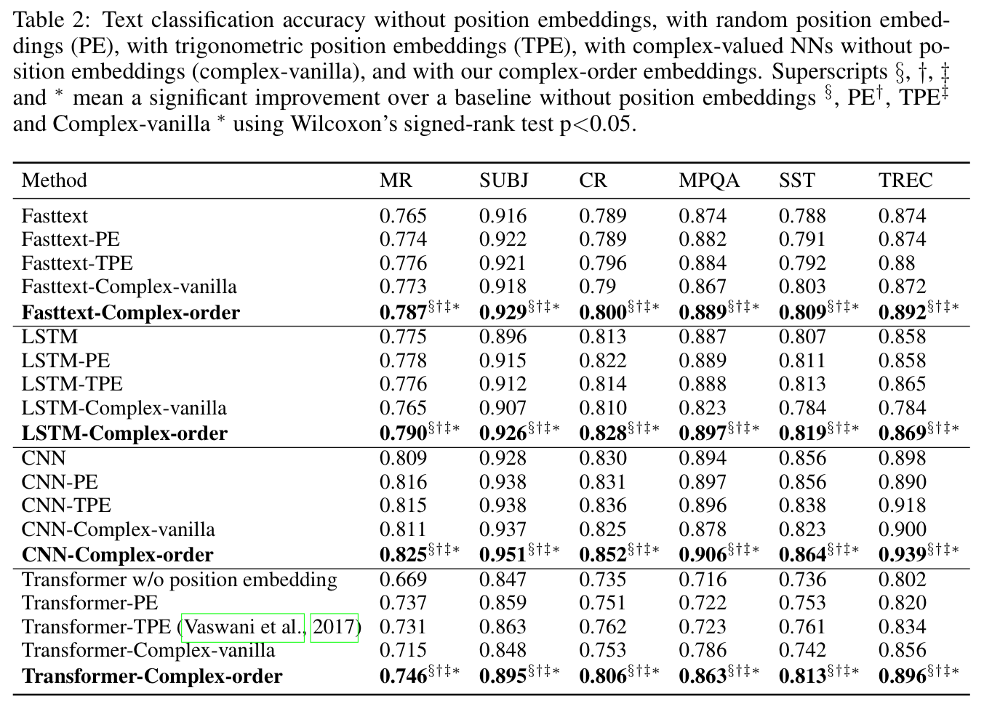

## Encoding Word Order in Complex Embeddings

Wang, et al.

U Padua, Tianjin U, U Copenhagen

2020 - ICLR

[Link](https://openreview.net/pdf?id=Hke-WTVtwr)

### Overview

In the original transformer model, word positions are encoded using positional embeddings. This is required because the self-attention mechanism only multiplies query and key vectors for the various words in a sentence/sequence--positional information is lost. Thus, the positional embeddings are summed with the word embeddings in the bottom/start of the network, such that the word embedding is adapted according to its position.

Relative sequencing between words is important for understanding language. Therefore, the chosen position encoding must preserve relative relationships between words irrespective of absolute position. The authors present a novel, generalized, complex representation of position for use in the encoding layer. Their method provides trainable complex (real and imaginary) parameters, and they prove how different positions correlate to each other relatively. They also show how the original transformer (Vaswani et al.) positional encodings are a special case of their method. Additionally, their positional encoding method includes a parameter that gauges the importance of positional information for a given word.

### Method
Each word embedding now takes on the following form:

Notice that each dimension in the new embedding has its own amplitude, period, and initial phase.

An offset transformation can be applied without respect to absolute position. I.E. moving from position 3 to 5 is equivalent to moving from position 10 to 12.

### Results

The complex positional encoder outperforms a number of baselines as shown below:

 
