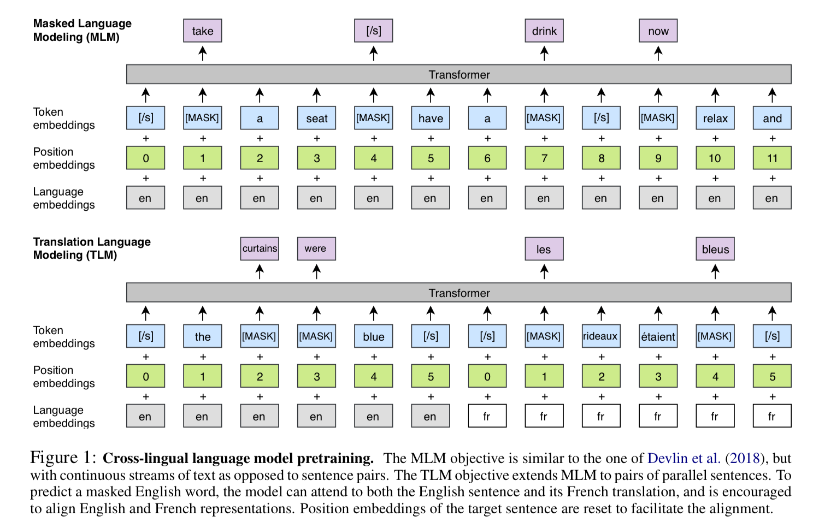

## Cross Lingual Language Model Pretraining

Lample and Conneau

FAIR

2019

[Link](https://arxiv.org/abs/1901.07291)

## Overview

Before XLM-R, there was XLM, which stands for Cross-lingual Language Models. This model achieved state of the art on Cross-Lingual Natural Language Inference (XNLI), as well as a few unsupervised and supervised machine translation benchmarks. XLM is a transformer-based model, and it’s pretrained on data from over 100 languages.

## Methods

* Sampling is performed using a multinomial distribution to upweight the low resource languages.
* Causal Language Modeling (CLM) is their first pretraining task. It’s standard language modeling.
* Masked Language Modeling (MLM) is the next pretraining task, a.k.a. the Cloze task, which is also used for BERT. However, they use text streams of 256 tokens, whereas BERT uses pairs of sentences. They also do sampling differently.
* Translation Language Modeling (TLM) is a new pretraining objective they introduce, in which pairs of parallel sentences from two languages are concatenated.

Pre-training:

## Architecture

The transformer uses 1,024 hidden units, 8 attention heads, GELU activations, a dropout of 0.1, ADAM for optimization, and a linear warmup.

