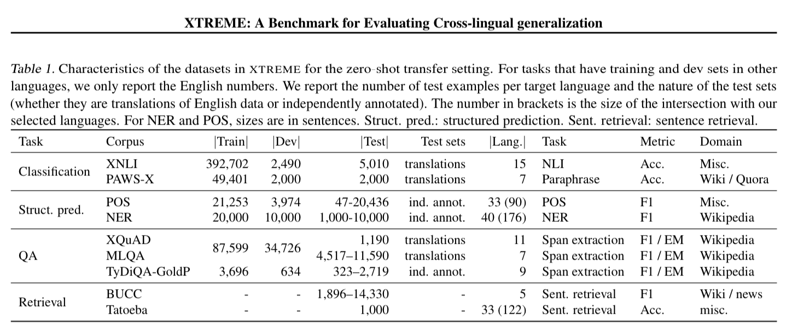
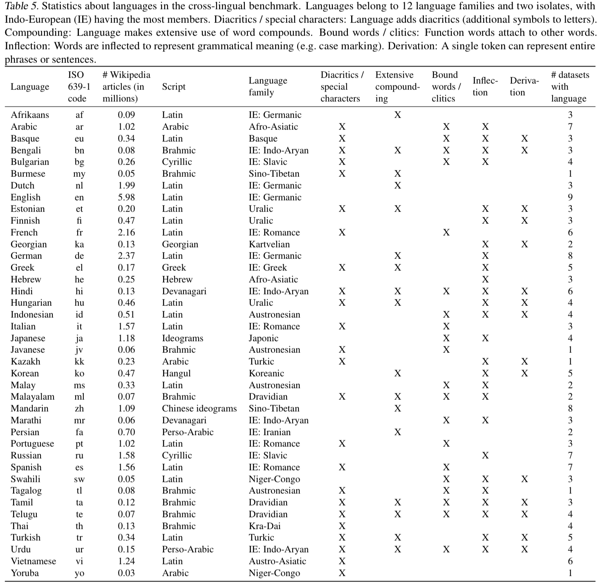

## XTREME: A Massively Multilingual Multi-task Benchmark for Evaluating Cross-lingual Generalization

Junjie Hu, Sebastian Ruder, et al.

Google Research

2020

[Link](https://arxiv.org/abs/2003.11080)

### Overview

XTREME is a new zero-shot test dataset for measuring generalization of multilingual models. The dataset spans 9 tasks and includes test data for 40 languages (though each task only has data for a subset of the languages). Fine tuning is performed in English, and zero-shot performance is tested in the other languages.

### Tasks

### Languages

